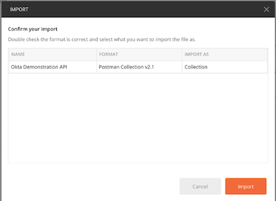
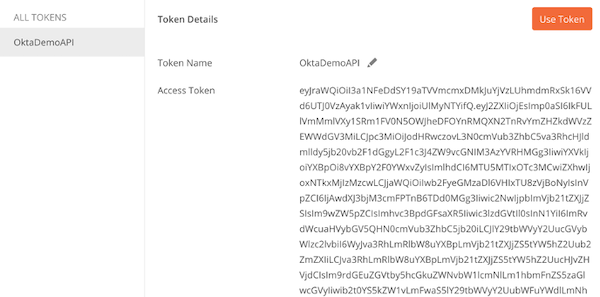

# Postman Setup

## Download Collection and Environment:
<postman/>

## Import into Postman
 - Import the downloaded files into Postman by selecting **Import** from the **File** menu.
 - In the **Import** window, leave **Import File** selected and click **Choose Files**.
 - Browse to your download location, select one of the JSON files, and click **Open**.
 - Click **Import**.
 - Repeat for the other file.

### Setup OAuth2 Authorization method
Edit the Postman collection to use an OAuth2 Authorization code flow token request leveraging values from the OIDC App (that UDP terraformed for you). This authorization method can be used for every request in the collection; just refresh the token as necessary.

- Click **Edit** on the Collection.
- On the EDIT COLLECTION screen's **Authorization** tab
  - Set the **Type** to **OAuth2**
  - Click **Get New Access Token**
  - On the GET NEW ACCEAS TOKEN screen, **copy and paste** the values below into the respective fields in Postman:

<!-- - On the GET NEW ACCEAS TOKEN screen, set:
  - **Token Name** = some value (e.g. *Postman Demo API*)
  - **Grant Type** = **Authorization Code**
  - **Callback URL** to the Okta OIDC App's `redirect_uri`
    - Uncheck (or leave unchecked) **Authorize using browser**
  - **Auth URL** = **Issuer URI** (of the Okta Auth Server) + `/v1/authorize`
  - **Access Token URL** = **Issuer URI** (of the Okta Auth Server) + `/v1/token`

  - **Client ID** = Okta OIDC App's `client_id`
  - **Client Secret** = Okta OIDC App's `client_secret`
  - **Scope** = list of scopes for your intended access request
  - **State** = some random value
  - **Client Authentication** = **Send client credentials in body**

##### Example

| Attribute | Setting |
| :-------------| :--------- |
|  **Token Name** | *OktaDemoAPI* |
|  **Grant Type** | **Authorization Code** |
|  **Callback URL** | *https://localhost:5001/signin-oidc* |
|  **Authorize using browser** | *(unchecked)* |
|  **Auth URL** | *https://udp-demo-api-e3d.oktapreview.com/oauth2/aussff343aOzmWSLG0h7/v1/authorize* |
|  **Access Token URL** | *https://udp-demo-api-e3d.oktapreview.com/oauth2/aussff343aOzmWSLG0h7/v1/token* |
|  **Client ID** | *_(generated)_* |
|  **Client Secret** | *_(generated)_* |
|  **Scope** | *openid system ecommerce hospitality* |
|  **State** | *foo* |
|  **Client Authentication** | *Send client credentials in body* | -->

<postmanAccessToken/>

### Get Token
- Click **Request Token**. You should be prompted for Okta authentication, then...
- Authenticate as one of your authorized users. 

After successfully authenticating, you should be returned to the MANAGE ACCESS TOKENS screen.

- Click **Use Token**
You should be returned to the EDIT COLLECTION screen's Authorization tab.
- Click **Update**

## Try it out
* Now, with the access token in place, try out the API calls in the Collection.
  * For example, remove the access token from the requests. See what happens.

